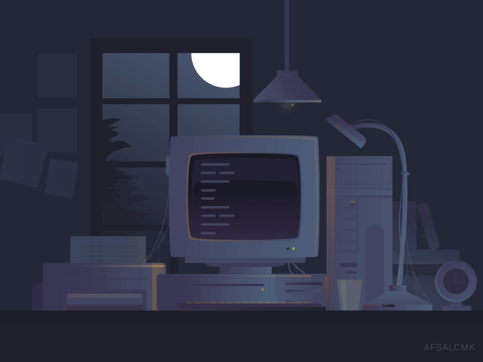

### <samp>System.out.println("Hey 👋")</samp>

I'm Giorgi, QA Automation Engineer. I specialize in <strong>Java</strong> and <strong>JavaScript</strong> based testing frameworks for <strong>UI</strong>, <strong>Database</strong> and <strong>Rest APIs</strong>. I use <strong>Selenium WebDriver</strong> along with different tools and libraries to build efficient testing solutions. I enjoy <strong>JS</strong> and am actively learning <strong>WDIO</strong>, <strong>Cypress</strong> as well as <strong>Mobile</strong> and <strong>Performance</strong> testing.

<h3 align='left'><samp>⚙️ Tech Stack</samp></h3>

- Languages: `Java`, `JavaScript`
- Testing Tools: `Selenium WebDriver`, `TestNg`, `Cucumber`, `Sauce Labs`, `WDIO`, `Extent/Allure Reports`
- Other Tools: `Azure DevOps`, `Jira`, `Maven`, `Jenkins`, `Git`, `GitHub`, `GitLabs`
- API Tools: `Postman`, `Mocha.js`, `Chai.js`, `Request Promise`
- Database: `SQL Server`, `SSMS`
- Environments: `Mac OS`, `Windows`, `Android`

<h3 align='left'><samp>🚀 Fun Facts</samp></h3>

I'm a big fan of Sci-Fi movies, books and art.
 <strong>Blade Runner, Aliens</strong> & <strong>LOTR</strong> are my all time favorites.
  

Currently reading <strong>Recursion</strong> by Blake Crouch. Read books by PKD, William Gibson, Andy Weir, etc..
  
I love art, workouts, sports and travel with friends.  Nature and mountains is perhaps where I belong.
  
I speak English and am bilingual in Russian & Georgian. 

Lost half of 2022 to <strong>Elden Ring</strong>. Highly recommended.
